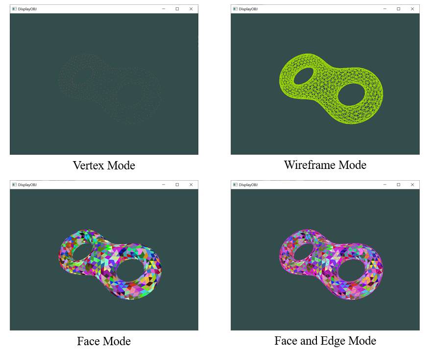

# Display OBJ


## Function
Display of 3D model

* Loading a 3D mesh model and display it on the screen

* Four modes are supported: wireframe mode, vertex mode, face mode, face and edge mode.  Mode is switched by keyboard. Under the face mode, the color of each face is different.

* Rotate and translate the model by keyboard

* Change colors under wireframe mode by keyboard.

Written by Xiaotian Cheng (cxt_tsinghua@126.com)

## Environment
* Windows 10 (19042.867), 64bit
* Microsoft Visual Studio 2017 

## Usage
put the shading script ([`main.frag.glsl`](data/main.frag.glsl) and [`main.vert.glsl`](data/main.vert.glsl)) and your obj file in the same directory as the binary executive file `DisplayOBJ.exe`
```cmd
DisplayOBJ.exe filename.obj
```

### Switch mode
* Press `1`: switch to vertex mode
* Press `2`: switch to wireframe mode
* Press `3`: switch to face mode
* Press `4`: switch to face and edge mode

### Translation
* Press `l` and `r` to translate object in x-axis in its frame
* Press `u` and `d` to translate object in y-axis in its frame
* Press `f` and `b` to translate object in z-axis in its frame

### Rotation
* Press `L` and `R` to rotate object in x-axis in its frame
* Press `U` and `D` to rotate object in y-axis in its frame
* Press `F` and `B` to rotate object in z-axis in its frame

### Change wireframe color
When in wireframe mode or face and edge mode, press `c`/`C` to change color of edges.